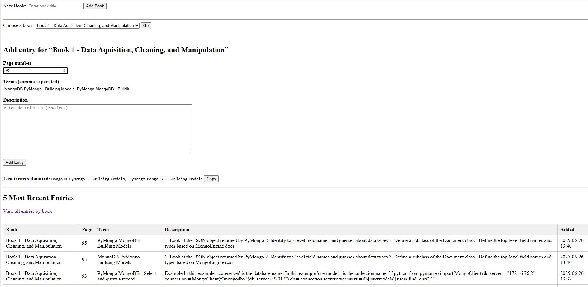

### Indexer — Dockerized Django Stack

A lightweight, container-based web app for organizing and tracking course material indexes.

---



---

## ✨ Key Points

| Component                            | Purpose                                                                         |
| ------------------------------------ | ------------------------------------------------------------------------------- |
| **Django 4 + Gunicorn**              | Core web application (`core/`, `home/`)                                         |
| **PostgreSQL 16**                    | Persistent data store (`db` service)                                            |
| **Nginx**                            | Reverse-proxy & static/media delivery (`nginx/`)                                |
| **code-server (VS Code in browser)** | Optional in-container IDE at **[http://127.0.0.1:8443](http://127.0.0.1:8443)** |
| **Docker & Docker Compose**          | One-command setup on Linux / WSL Ubuntu 24.04                                   |

---

## ⚡ Quick Start

```bash
# Prerequisites: Docker & Docker Compose installed
git clone https://github.com/millalgo/indexer.git
cd indexer
cp .env.example .env   # add secrets if needed

docker compose up --build
```

* **Web app:** [http://127.0.0.1](http://127.0.0.1)
* **code-server:** [http://127.0.0.1:8443](http://127.0.0.1:8443) (login token printed on first run)

The `entrypoint.sh` script waits for Postgres, runs migrations, collects static files, and starts Gunicorn automatically.

---

## 🗂️ Project Layout

```
Dockerfile            # Python 3.12 runtime
docker-compose.yml    # 3 services: web, db, nginx
core/                 # Django project settings / WSGI / ASGI
home/                 # Example app (models, views, templates)
nginx/default.conf    # Reverse-proxy config
entrypoint.sh         # Init script (migrate, collectstatic)
requirements.txt      # Python dependencies
```

---

## 🔧 Configuration

| Variable (in `.env`) | Default                  | Description                 |
| -------------------- | ------------------------ | --------------------------- |
| `DJANGO_SECRET_KEY`  | *none*                   | **Required** for production |
| `DJANGO_DEBUG`       | `True`                   | Set `False` in prod         |
| `POSTGRES_*`         | see `docker-compose.yml` | DB credentials              |

---

## 🚧 Upcoming Features

| Feature                    | What it will do                                                                                                                                                                       | Status     |
| -------------------------- | ------------------------------------------------------------------------------------------------------------------------------------------------------------------------------------- | ---------- |
| **Master Index Generator** | Automatically merge all per-chapter indexes into a single, searchable master file (CSV + PDF). Will also support scheduled re-builds after every import.                              | 🎯 Planned |
| **Book Color Selector**    | Lets you assign and persist a color theme for each course book/binder. Provides a small palette-picker UI and stores the choice in user settings for consistent visuals across pages. | 🎯 Planned |

---

## ⚠️ Deployment & Security

This application is intended to be **self‑hosted** on your own infrastructure. Deploying it to a public or shared hosting environment is outside its intended use and may introduce significant security risks unless you implement proper hardening measures (TLS, authentication, network isolation, etc.).

---

## 🛡️ License

Apache License 2.0 — see [`LICENSE`](LICENSE) for details.

---
